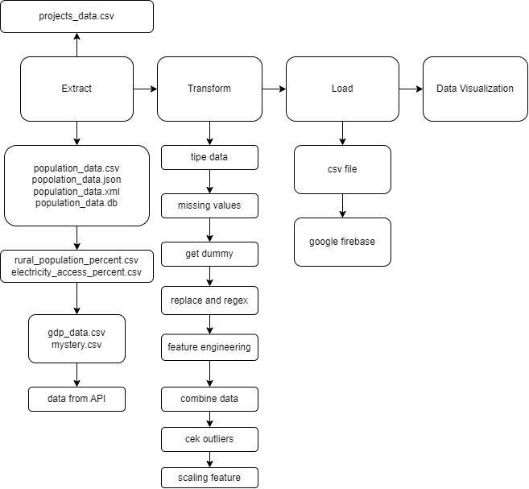

# Project Name
Social-Economic Countries

# About Project
Social-Economic Countries merupakan kumpulan data dari tahun 1960 hingga 2023 yang mencakup informasi ekonomi dan sosial dari berbagai negara di seluruh dunia. Ini mencakup beberapa variabel penting seperti Produk Domestik Bruto (GDP), populasi, GDP per kapita, persentase populasi pedesaan, persentase populasi dengan akses listrik, dan biaya proyek. Data ini telah melalui proses ETL (Ekstraksi, Transformasi, dan Loading) untuk memastikan kebersihan dan kualitas data. Dataset ini dapat digunakan untuk analisis ekonomi, pemodelan prediktif, serta penelitian dalam berbagai bidang seperti ekonomi, sosiologi, dan ilmu politik.

# Tech Stacks
Tools:
- Visual Studio Code
- Jupyter Notebook
- Github Desktop
- Github

Frameworks:
- import re # Regular expression - combine projects data
- import os # Berinteraksi dengan sistem operasi - load
- import pandas as pd # Membaca, memanipulasi, dan menganalisis data dalam bentuk tabel (DataFrame) - extract, transform, load
- import sqlite3 # Database SQLite - extract
- import requests # API - extract
- import seaborn as sns # Plot - outliers
- import matplotlib.pyplot as plt # Plot - outliers
- import plotly.express as px # Plot interaktif - data visualization
- from bs4 import BeautifulSoup # Parsing dokumen XML - extract
- from dotenv import load_dotenv # Lingkungan variable - .env
- from firebase_admin import credentials, initialize_app, storage # Firebase - load
- from sklearn.preprocessing import StandardScaler # Scaling feature
- from openai import OpenAI # AI

# Architecture Diagram

# Setup
- Clone repository proyek dari GitHub.
- Masuk ke dalam direktori proyek dan instal semua dependensi yang diperlukan.
- Ubah file konfigurasi (biasanya berupa file .env) untuk mencocokkan pengaturan lokal, termasuk konfigurasi database, sumber data, dan target data.
- Menjalankan proyek pipelines ETL
- Pantau proses ETL saat berjalan dan pastikan untuk menangani semua kesalahan atau masalah yang mungkin muncul.
- Pastikan bahwa data yang diekstrak, ditransformasi, dan dimuat (ETL) sesuai dengan yang diharapkan dengan menjalankan tes yang sesuai.
- Melakukan optimasi kinerja atau penyetelan lebih lanjut untuk meningkatkan kinerja atau keandalan.
